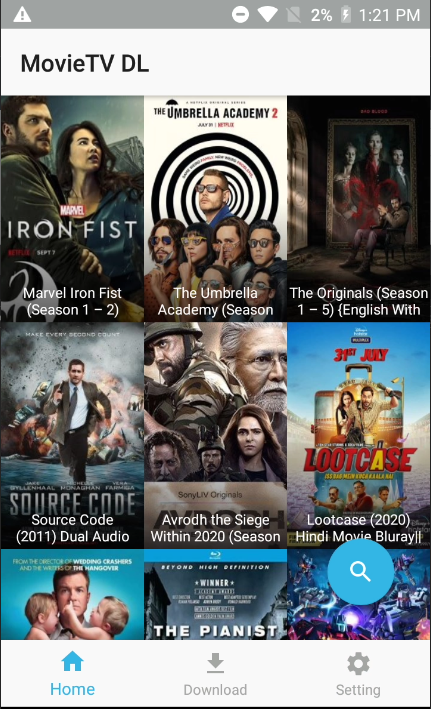

 
# MovieTV DL : Android Version
#### Latest Version 1.4
A simple app let you watch and download latest Movies/TV series.
Steaming and Downloading Movies/TV series becomes easy.

MovieTV DL is now open source. Feel free update or add new features.

## Feature version 1.4
* Fixed source 0.

## Feature version 1.3
* Fixed issues where TV series not starting or downloading in source 0.
* Removed source 1 as it stopped working.
* Asking for player option only comes one time know in case of TV series.
* Now shows season number along with the download button.
* Some Bug Fixes.

## Feature version 1.2
* Updated Scrollview in Movie or TV Series screen.
* Fixed source 0 movies or TV series which are not shows links.
* Some Bug Fixes

## Feature version 1.1
* Fixed source 0 with new server.
* Some Bug Fixes

## Feature version 1.0
* Auto check for update
* Dark Theme support.
* Inbuilt video player for streaming.
* External player support, you can set as default or select at the time of playing episode.
* Multiple sources to download from. More sources on the way.
* Easy to use and navigate
* Integrated download manager for fast downloading.
* Queue support. #Option to select parallel download in settings.
* Faster Movies/TV series searching and loading.
* Click to directly start the video from download menu for whose which are completed.(It goes with the default setting means internal or external whichever is set in settings, no confirmation dialog).
* Download folder location option.
* Added pulldown to refresh home function.
* and many more

### Some Button Means:
#### "Switch on the Stream Mode"
* OFF state = Download Mode, starts the download.
* ON state = Stream Mode, Play the video with player of your choose.

### Note:-
* If you have any suggestion or new feature idea feel free to contact me.
* I want make this app to reach as many as people as possible please help me with that as i don't know any other platform to share this app.
* For any issue feel free to email me.(Email in setting of application)

Download Link:- Please see the released section. 
Alternative Download Links:- http://a.animedlweb.ga/

Download Anime DL app for PC and android Link:- http://a.animedlweb.ga/

(Note:- If you facing any issue during installation, uninstall old version and try again).

#### Requirements:
    * Internet
    * Android 5 or higher installed.
   
	
Install the application downloaded APK and start the app from your launcher.

